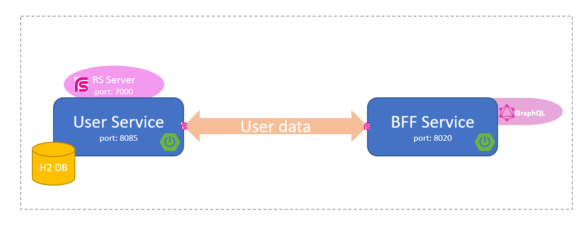
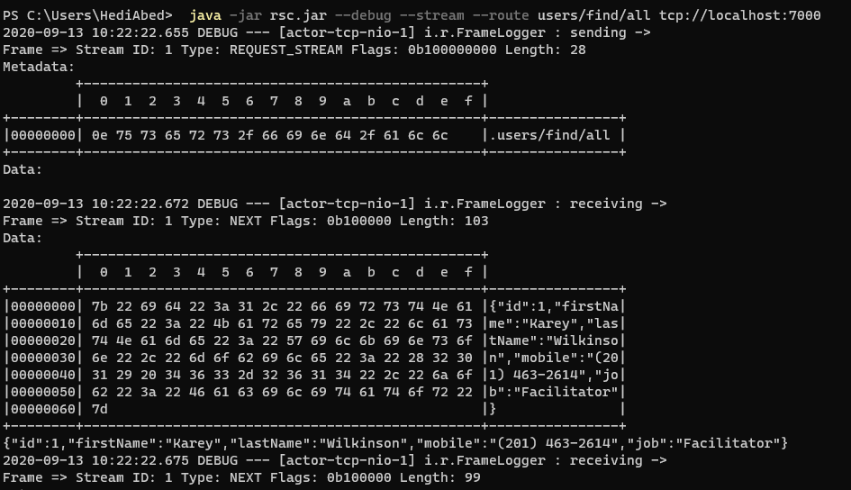

# RSocket + GraphQL 

# About

*Build two Spring-Boot applications that comunicate with each oether via Rsocket also display and query the data via GraphQl.*



# RSocket
#### What is RSocket?

RSocket is an application protocol initially developed by Netflix that supports Reactive Streams and enable to make a remote communication between services. The motivation behind its development was to replace hypertext transfer protocol, which is inefficient for many tasks such as microservices communication.

#### 1) user-service
* Config Rsocket server:
```yaml
# application.yml
spring:
  rsocket:
    server:
      port: 7000
      transport: tcp
```

* The RSocket server controller:

**@MessageMapping**: This annotation declares that any messages with metadata containing the RSocket route should be handled by this method. Also, this route will be used later when for sending a request message from the client (BFF Service).


```java
@Controller
@AllArgsConstructor
public class UserController {
...
    @MessageMapping("users/find/all")
    public Flux<User> all() {
        return userService.findAll();
    }
...
}
```
* You can start the server by the following cmd:
```sh
$ ./mvnw clean package spring-boot:run -DskipTests=true
```
* RSocket Client CLI
you can send a request to the running server using the RSocket client.

**- Download CLI**
```sh
$ wget -O rsc.jar https://github.com/making/rsc/releases/download/0.4.2/rsc-0.4.2.jar
```
**- Help**
```sh
$ java -jar rsc.jar --help
```
**- Request-stream**
```sh
$ java -jar rsc.jar --debug --stream --route users/find/all tcp://localhost:7000
```

When the command runs, you will see some debug information in the terminal window explaining what happened during the request-stream interaction. It looks something like this:



The RSocket **rsc** client sends a request to the **RSocketController** using the RSocket messaging protocol. The request is sent over TCP to the address **tcp://localhost:7000** where the server is waiting. A message routing instruction is sent in the first message frame. This routing instruction is set using the **--route** option of the CLI client and is set to **users/find/all** . Spring uses this routing information to select the correct **@MessageMapping** endpoint to call. The method then responds with a message of its own. The CLI client prints the whole interaction in the terminal window as a series of message frames. 

#### 2) bff-service
We need to create a configuration class for configurin **RSocketRequester** Bean and set **Jackson** Encoder and Decoder strategies.
***Jackson:**  will help us to **map json to object** in our case "User.class"*
```java
@Configuration
public class ClientConfiguration {
    @Bean
    RSocketRequester rSocketRequester(final RSocketStrategies rSocketStrategies) {
        return RSocketRequester.builder()
                .rsocketConnector(
                    rSocketConnector -> rSocketConnector.reconnect(Retry.fixedDelay(2,Duration.ofSeconds(2)))
                )
                .dataMimeType(MediaType.APPLICATION_JSON)
                .rsocketStrategies(rSocketStrategies)
                .connect(TcpClientTransport.create(7000))
                .retry()
                .block();
    }
    @Bean
    public RSocketStrategies rSocketStrategies() {
        return RSocketStrategies.builder()
                .encoders(encoders -> encoders.add(new Jackson2JsonEncoder()))
                .decoders(decoders -> decoders.add(new Jackson2JsonDecoder()))
                .build();
    }
}
```

Then we use **RSocketRequester** to request user-service server 

```java
@Service
public class UserService {
    private final RSocketRequester rSocketRequester;
    
    public Flux<User> getAll(){
        return rSocketRequester.route("users/find/all").retrieveFlux(User.class);
    }
...
}
```

# GraphQL 
#### What is GraphQL!
GraphQL is a data query and manipulation language for APIs developed by Facebook. it offers many benefits over REST APIs. One of the main benefits are Over-fetching and under:
* **Under-fetching:** is not having enough data with a call to an endpoint, forcing you to call a second endpoint... and GraphQL fixes this problem because it allows you to request which data you want in one trip to the server.
* **Over-fetching:** occurs when the server returns more data than needed... and GraphQL fixes this problem but given the ability to dictate exactly what needs from the server, and receive that data in a predictable way.

##### What is Query, Mutation and Schema !

* **Query:** Similar to GET call in REST and used by the client to query the fields.
* **Mutations:** It is similar to a POST/PUT call in REST and is used by the client for any insert/update operation.
* **Schema:** Describe the shape of your data graph and defines a hierarchy of types with fields.

#### GraphQL in code
##### Query & Mutation (service):

In GraphQL you can either define a query [**ex: @GraphQLQuery(name = "users")**] which will only load data, or define a mutation [**ex: @GraphQLMutation(name = "saveUser")**] which will also change the underlying data that feeds the API. 

```java
@Service
public class UserService {
...
    @GraphQLQuery(name = "users")
    public Flux<User> getAll(){
      // some code
    }

    @GraphQLMutation(name = "saveUser")
    public Mono<User> save(@GraphQLArgument(name = "user") CreateUser user){
        // some code
    }
    ...
}
```

We used GraphQL **SPQR**  *(GraphQL Schema Publisher & Query Resolver)* annotations *(@GraphQLQuery and @GraphQLMutation)* on the service to expose those names (players,savePlayer...)  in the API.

##### Schema (controller):

**SPQR**  configuration in the controller to generate Schema from query classes *[ex: UserService]*.

```java
@RestController
public class GraphQLController {
    private final GraphQL graphQL;
    @Autowired
    public GraphQLController(UserService userService) {
        //Schema generated from query classes
        GraphQLSchema schema = new GraphQLSchemaGenerator()
                .withBasePackages("com.demo.rsocket.bff.service")
                .withOperationsFromSingletons(userService)
                .generate();
        graphQL = GraphQL.newGraphQL(schema).build();
        log.info("Generated GraphQL schema using SPQR");
    }
    ...
}
```

**ExecutionResult** represents the result of execution. 
If the arguments to the function do not result in a legal execution context, a GraphQLError will be thrown immediately explaining the invalid input.

```java
@RestController
public class GraphQLController {
...
    @PostMapping(value = "/graphql")
    @ResponseBody
    public Map<String, Object> execution(@RequestBody Map<String, String> request, HttpServletRequest raw) {
        ExecutionResult executionResult = graphQL.execute(ExecutionInput.newExecutionInput()
                .query(request.get("query"))
                .operationName(request.get("operationName"))
                .context(raw)
                .build());
        return executionResult.toSpecification();
    }
 ...
}
```

#### GraphQL web interface:
* You can start the server by the following cmd: 
```sh
$ ./mvnw clean package spring-boot:run -DskipTests=true
```
( the server will be started on http://localhost:8020)
##### Queries examples:
you can use the queries and mutations examples to query and change the data.
 - Get All Users
```
query{
    users{
        firstName 
        lastName 
        id 
        job
    }
}
```
 - Get All User By Id
```
query{
    user(id:11){
        firstName 
        lastName 
        mobile 
        id 
        job
    }
}
```
##### Mutations examples:
 - Create User
 ```
mutation{
    saveUser(
        user:{
            firstName: "Hedi" , 
            lastName: "Abed" ,
            mobile:"88888888" , 
            job: "programmer"
        }
    ){
       firstName 
       lastName 
       job 
       id
    }
}
```
 - Update User
 ```
mutation{ 
    updateUser(
        user:{
            id:11,
            firstName: "hedi" , 
            lastName: "abed" ,
            mobile:"88888889" , 
            job: "developer"
        }
    )
    {
        firstName 
        job
    }
}
```
